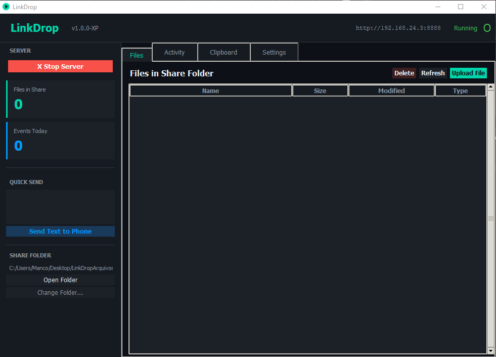

# LinkDrop

This is a python software created to transfer files between Android and Windows using Internet. You can set-up for remote acces (different networks) as well.

# Features
- Button to Start and Stop server
- Upload files on both Android and Windows
- Sync clipboard from both Android and Windows automatically
- Password option for security reasons
- IP, DDNS, VPN and Port configurations
- Notifications
- Activity logs
- Select exatcly where you want files to be saved locally

# Support
For Windows XP, Windows 7, Windows 8 (and 8.1), Windows 10, Windows 11

